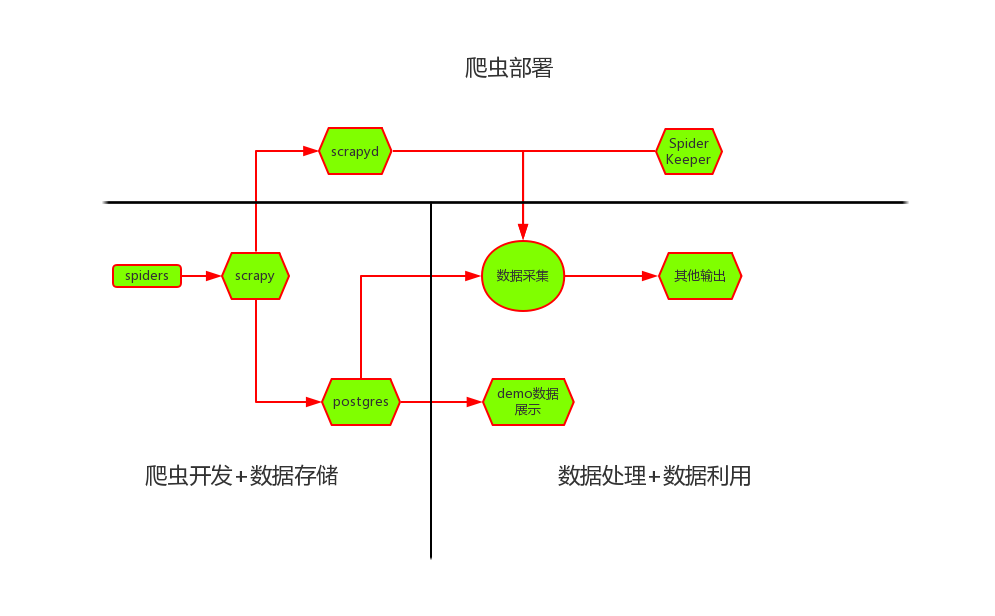

# app应用内数据爬取

## 依赖
* python3.6.2+
* postgres

## 说明

### 爬虫开发+数据存储
数据爬取采用scrapy框架，数据存储采用postgres。
数据库账号配置文件`.\appspider\configs\postgreconfig.py`：

```
# 数据库名称，与数据库中一致
db_bs = 'appspiders'

postgre_configs = {
    'database': db_bs,
    'user': '$user',
    'password': '$passwd',
    'host': '$ip',
    'port': '$port'
}

```
备注：本地测试时，可以不使用数据库，而将结果保存到本地txt文件。修改`settings.py`文件，注释掉`appspider.pipelines.PostgreSQLPipeline`，并且打开`appspider.pipelines.AppspiderPipeline`注释。

```
ITEM_PIPELINES = {
   'appspider.pipelines.AppspiderPipeline': 300,
   # 'appspider.pipelines.PostgreSQLPipeline': 300,
}
```
### 爬虫部署（暂时不加入）
爬虫部署后端采用[scrapyd](https://github.com/scrapy/scrapyd)，Web前端使用[SpiderKeeper](https://github.com/DormyMo/SpiderKeeper)。
将项目打包成*.egg文件，推送到scrapyd，在使用SpiderKeeper做控制，实现定时爬取。

### 数据处理+数据利用（暂时不加入）
例如做统计分析。

## 应用列表
|app|进度|示例数据|消息编号|备注|
|:-----:|:-----:|:-----:|:-----:|:-----:|
|裁判文书|✔||AppSpider-0000-000|校验算法|
|饿了么|doing||AppSpider-0001-001|请求参数|
|百度外卖|✔|[百度外卖测试数据](http://appspider.info:8002/baiduwaimai)|AppSpider-0002-001|定位问题|
|抖音|✔|[抖音测试数据](http://appspider.info:8002/douyin2)|AppSpider-0003-002|附近接口|
|快手|✔|[快手测试数据](http://appspider.info:8002/kuaishou101)|AppSpider-0005-001|附近接口|
|秒拍|✔|[秒拍测试数据](http://appspider.info:8002/miaopaix)|AppSpider-0006-002|附近接口|
|裁判文书网|✔||AppSpider-0007-001|动态密钥生成算法|
|oppo应用市场|doing||AppSpider-0008-001|protobuf结构体|
|小米应用市场|✔||AppSpider-0009-001|评论，appid参数|
|...|...|...|...|

## 结构


